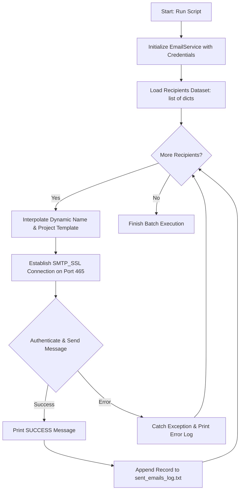

# 📪 PROJECT 6: AUTOMATED BULK E-MAIL SENDER !

A production-ready Python automation tool designed to dispatch personalized batch emails over encrypted SSL with real-time file activity logging.

---

## 📑 Table of Contents

- [📌 Project Overview](#-project-overview)
- [✨ Key Features](#-key-features)
- [🔄 System Workflow](#-system-workflow)
- [🔑 Google App Password Setup Guide](#-google-app-password-setup-guide)
- [📂 File Architecture](#-file-architecture)
- [💻 Complete Source Code](#-complete-source-code)
- [🚀 Execution & Live Logging](#-execution--live-logging)
- [🛡️ Security Best Practices](#️-security-best-practices)

---

## 📌 Project Overview

The **Bulk Email Sender** project demonstrates how to connect Python applications to real-world email servers using `smtplib` and `email.message.EmailMessage`. It combines multiple core Python concepts:
- **Object-Oriented Programming (OOP)**: Encapsulating connection details and sending logic inside an `EmailService` class.
- **Dynamic String Formatting (f-strings)**: Personalizing email subject lines and body copy per recipient.
- **Data Structures**: Managing recipient lists as collections of dictionaries (`list[dict]`).
- **File I/O**: Persisting transaction logs to `sent_emails_log.txt`.
- **Exception Handling**: Catching network errors and authentication failures gracefully without crashing the batch.

---

## ✨ Key Features

- **Encrypted SSL Delivery**: Uses `smtplib.SMTP_SSL` on Port `465` for end-to-end encryption.
- **Dynamic Personalization**: Automatically populates recipient names, projects, and custom values per email.
- **Automated File Logging**: Appends all successfully sent emails with timestamps to `sent_emails_log.txt`.
- **Clean OOP Design**: Structured around a reusable `EmailService` class with error isolation.

---

## 🔄 System Workflow



---

## 🔑 Google App Password Setup Guide

> **Important**: Google requires a **16-character App Password** for external scripts. Your regular account password will be rejected.

| Step | Action | Instructions |
| :---: | :--- | :--- |
| **1** | **Enable 2-Step Verification** | Go to your **Google Account Security** and turn ON **2-Step Verification**. |
| **2** | **Find App Passwords** | Search **"App passwords"** in the top search bar inside Google Account settings. |
| **3** | **Generate Password** | Enter an application name (e.g. `Python Emailer`) and click **Create**. |
| **4** | **Copy Key** | Copy the 16-character code (e.g. `abcd efgh ijkl mnop`) and remove spaces. |
| **5** | **Configure Script** | Paste into `APP_PASSWORD = "abcdefghijklmnop"`. |

---

## 📂 File Architecture

```text
bulk-email-sender/
├── email_sender.py          # Core application with EmailService class
├── sent_emails_log.txt      # Real-time generated execution log file
└── README.md                # Comprehensive documentation
```

---

## 💻 Complete Source Code

```python
"""
PROJECT 6 - BULK EMAIL SENDER
Demonstrating OOP, SMTP/SSL, File I/O, and String Templating in Python.
"""

import smtplib
from email.message import EmailMessage
import os


class EmailService:
    """Encapsulates email creation, SMTP SSL delivery, and automated logging."""

    def __init__(self, sender_email: str, app_password: str):
        self.sender_email = sender_email
        self.app_password = app_password
        self.smtp_server = "smtp.gmail.com"
        self.port = 465  # SSL Secure Port

    def send_email(self, recipient_email: str, subject: str, body: str) -> bool:
        """Creates and dispatches an individual email over an SSL tunnel."""
        msg = EmailMessage()
        msg["From"] = self.sender_email
        msg["To"] = recipient_email
        msg["Subject"] = subject
        msg.set_content(body)

        try:
            # Establish encrypted SSL connection
            with smtplib.SMTP_SSL(self.smtp_server, self.port) as server:
                server.login(self.sender_email, self.app_password)
                server.send_message(msg)
                print(f"[DONE] Successfully sent email to: {recipient_email}")

                # Automatically record log entry
                self.log_sent_email(recipient_email, subject)
                return True
        except Exception as error:
            print(f"[ERROR] Failed sending to {recipient_email}. Reason: {error}")
            return False

    def log_sent_email(self, recipient_email: str, subject: str) -> None:
        """Appends a persistent record of the email to sent_emails_log.txt."""
        with open("sent_emails_log.txt", "a", encoding="utf-8") as log_file:
            log_file.write(f"Sent To: {recipient_email} | Subject: {subject}\n")


def run_bulk_emailer():
    """Main routine to batch process personalized emails."""
    
    # 1. Authentication Credentials
    SENDER = "your_email@gmail.com"
    APP_PASSWORD = "your_16_char_app_password"

    # 2. Instantiate Service (OOP)
    service = EmailService(sender_email=SENDER, app_password=APP_PASSWORD)

    # 3. Recipient Dataset (List of Dictionaries)
    recipients = [
        {"name": "Alice", "email": "alice@example.com", "project": "QR Generator"},
        {"name": "Bob", "email": "bob@example.com", "project": "Weather Checker"},
        {"name": "Charlie", "email": "charlie@example.com", "project": "Portfolio Website"},
    ]

    # 4. Iterate and Dispatch
    print(f"Starting email dispatch for {len(recipients)} recipients...\n")
    for person in recipients:
        subject_line = f"Update on your project: {person['project']}"
        
        email_body = f"""Hello {person['name']},

Thank you for your hard work on {person['project']}.
Your submission has been reviewed successfully!

Best regards,
Python Automation Team
"""
        service.send_email(person["email"], subject_line, email_body)

    print("\nAll operations finished.")


if __name__ == "__main__":
    run_bulk_emailer()
```

---

## 🚀 Execution & Live Logging

### 1. Run the Python Script
```bash
python email_sender.py
```

### 2. Live Terminal Output
```text
Starting email dispatch for 3 recipients...

[DONE] Successfully sent email to: alice@example.com
[DONE] Successfully sent email to: bob@example.com
[DONE] Successfully sent email to: charlie@example.com

All operations finished.
```

### 3. Generated Log File (`sent_emails_log.txt`)
```text
Sent To: alice@example.com | Subject: Update on your project: QR Generator
Sent To: bob@example.com | Subject: Update on your project: Weather Checker
Sent To: charlie@example.com | Subject: Update on your project: Portfolio Website
```

---

## 🛡️ Security Best Practices

> **Tip**: Use Environment Variables for production environments. Never hardcode credentials in your code repository.

Install `python-dotenv`:
```bash
pip install python-dotenv
```

Create a `.env` file:
```env
SENDER_EMAIL=your_email@gmail.com
GMAIL_APP_PASSWORD=abcdefghijklmnop
```

Load securely in Python:
```python
import os
from dotenv import load_dotenv

load_dotenv()
SENDER = os.getenv("SENDER_EMAIL")
APP_PASSWORD = os.getenv("GMAIL_APP_PASSWORD")
```

---

## 📄 License

This repository is maintained for educational reference and Python mastery. Free to use, adapt, and share!

---

<div align="center">

Made with ❤️ for mastering Python | ⭐ Star this repo if you found it helpful AUTHOR - ADESH SRIVASTAVA(TANMAY)!

</div>