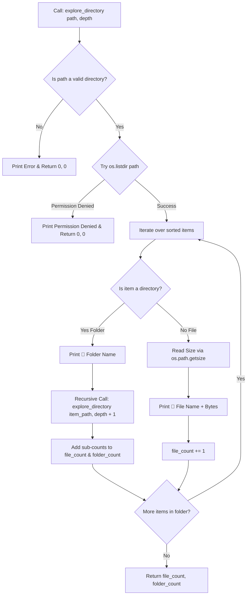

<div align="center">

# 🌳 Project 9: Recursive File/Directory Explorer

[](https://www.python.org/)
[](https://en.wikipedia.org/wiki/Recursion_(computer_science))
[-10B981?style=for-the-badge)](https://docs.python.org/3/library/os.html)
[](https://code.visualstudio.com/)
[](LICENSE)

<p align="center">
  A clean, recursive Command-Line Interface (CLI) utility to traverse, inspect, and visualize nested directory structures as an indented hierarchy tree with file sizes and item counters.
</p>

---

</div>

## 📑 Table of Contents

- [📌 Project Overview](#-project-overview)
- [🧠 Understanding Recursion in File Traversal](#-understanding-recursion-in-file-traversal)
  - [1. The Base Case (When to Stop)](#1-the-base-case-when-to-stop)
  - [2. The Recursive Case (Going Deeper)](#2-the-recursive-case-going-deeper)
  - [3. Aggregating Return Values](#3-aggregating-return-values)
- [✨ Key Features](#-key-features)
- [🔄 Recursive Traversal Workflow](#-recursive-traversal-workflow)
- [📂 File Structure](#-file-structure)
- [💻 Complete Source Code](#-complete-source-code)
- [🖥️ Sample CLI Output](#️-sample-cli-output)
- [🚀 Quick Start & How to Run](#-quick-start--how-to-run)
- [📄 License](#-license)

---

## 📌 Project Overview

Navigating nested filesystem trees is one of the most classic and practical applications of **Recursion (Depth-First Search)**. 

The **Recursive File/Directory Explorer** walks through any given folder path, descends into all child sub-directories, prints formatted folder/file names with exact byte sizes, and bubbles up total counts of files and folders back to the caller.

---

## 🧠 Understanding Recursion in File Traversal

Recursion is when a function calls itself to solve smaller instances of the same problem. In this project:

### 1. The Base Case (When to Stop)
Without a base case, recursion runs infinitely and triggers a `RecursionError: maximum recursion depth exceeded`.
- **Condition 1**: The path is not a valid folder (`os.path.isdir(path)` is `False`).
- **Condition 2**: The operating system blocks access (`PermissionError`).
- **Action**: Return `(0, 0)` immediately.

### 2. The Recursive Case (Going Deeper)
- When an item inside the current directory is another directory:
  ```python
  f, d = explore_directory(item_path, depth + 1)
  ```
- `depth + 1` increases the indentation (`"  " * depth`) so nested children are visibly indented under their parent folder.

### 3. Aggregating Return Values
As the recursive calls finish and unwind from deep subfolders back to root:
- `file_count += f`
- `folder_count += d`

---

## ✨ Key Features

- 📁 **Visual Tree Hierarchy**: Uses dynamic indentation (`"  " * depth`) to format folders (`📁`) and files (`📄`).
- ⚖️ **Accurate File Sizing**: Reads exact disk sizes in bytes using `os.path.getsize()`.
- 🛡️ **Graceful Permission Handling**: Safely catches `PermissionError` on protected system paths.
- 🧮 **Comprehensive Summary Counter**: Tracks and returns cumulative counts for all files and folders.
- ⚡ **Zero External Dependencies**: Built entirely with Python's standard `os` library.

---

## 🔄 Recursive Traversal Workflow



---

## 📂 File Structure

```text
recursive-directory-explorer/
├── 📄 directory_explorer.py    # Main recursive explorer script
└── 📄 README.md                # Comprehensive documentation
```

---

## 💻 Complete Source Code

```python
"""
PROJECT 9 - Recursive File/Directory Explorer
Demonstrating Recursion (Base Case, Recursive Case), OS file inspection, and depth tracking.
"""

import os


def explore_directory(path: str, depth: int = 0) -> tuple:
    """
    Recursively explores path and prints its structure.

    Parameters:
        path (str): The directory path to inspect.
        depth (int): The current nesting level for visual indentation.

    Returns:
        tuple[int, int]: (total_files, total_folders) found within this path.
    """
    # ----------- 1. BASE CASE -----------
    # If the path is not a valid directory, stop recursion immediately.
    if not os.path.isdir(path):
        print("  " * depth + f"[Not a valid directory] {path}")
        return 0, 0

    # Safely attempt to read directory contents
    try:
        items = sorted(os.listdir(path))
    except PermissionError:
        print("  " * depth + f"[Permission Denied] {path}")
        return 0, 0

    file_count = 0
    folder_count = 0

    # ----------- 2. RECURSIVE CASE & ITERATION -----------
    for item in items:
        item_path = os.path.join(path, item)
        indent = "  " * depth

        if os.path.isdir(item_path):
            # Item is a Subdirectory
            print(f"{indent}📁 {item}/")
            folder_count += 1

            # Recursive Call: Step into the subfolder at depth + 1
            f, d = explore_directory(item_path, depth + 1)
            file_count += f
            folder_count += d
        else:
            # Item is a File
            size = os.path.getsize(item_path)
            print(f"{indent}📄 {item} ({size} bytes)")
            file_count += 1

    # Return aggregated counts back up the call stack
    return file_count, folder_count


def main():
    """Main CLI entrypoint."""
    folder_path = input("Enter folder path to explore (press Enter for current folder): ").strip()

    if folder_path == "":
        folder_path = "."

    print(f"\nExploring: {os.path.abspath(folder_path)}\n" + "-" * 45)

    # Initial recursive call
    total_files, total_folders = explore_directory(folder_path)

    print("-" * 45)
    print(f"Total Files   : {total_files}")
    print(f"Total Folders : {total_folders}")


if __name__ == "__main__":
    main()
```

---

## 🖥️ Sample CLI Output

```text
Enter folder path to explore (press Enter for current folder): 

Exploring: /Users/developer/projects/PYTHON-A-TO-Z
---------------------------------------------
📁 CH-1-Intro/
  📄 main.py (1420 bytes)
📁 CH-2-Strings/
  📄 notes.py (2310 bytes)
📁 CH-3-Tuples-Lists/
  📄 list_ops.py (1890 bytes)
📁 assets/
  📄 logo.png (45210 bytes)
📄 README.md (6540 bytes)
---------------------------------------------
Total Files   : 5
Total Folders : 4
```

---

## 🚀 Quick Start & How to Run

1. Open your terminal in the directory where `directory_explorer.py` is saved.
2. Run the script:
   ```bash
   python directory_explorer.py
   ```
3. Type any relative or absolute path (e.g. `.` for current folder or `/path/to/project`) and press <kbd>Enter</kbd>!

---

## 📄 License

This repository is maintained for educational reference and Python mastery. Free to use, adapt, and share!

---

---

<div align="center">

Made with ❤️ for Mastering Python Recursion & File Systems | ⭐ Star this project if you found it useful AUTHOR - ADESH SRIVASTAVA(TANMAY)!

</div>
