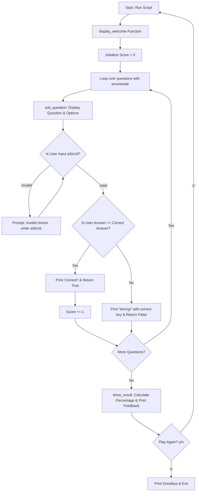

# PROJECT 10 - TEXT-BASED PYTHON Quiz Game

[](https://www.python.org/)
[](https://git-scm.com/)
[](https://developer.mozilla.org/en-US/docs/Web/JavaScript)
[](https://code.visualstudio.com/)
[](https://github.com/)

> A clean, beginner-friendly Command-Line Interface (CLI) trivia game designed to test core Python concepts using functions, nested data structures, input validation, and dynamic scoring.

---

## Project Overview

The **Text-Based Quiz Game** is an interactive, multi-choice CLI quiz application. It walks players through a curated set of questions covering Python fundamentals (syntax, data types, operators, functions, and control flow).

The project is intentionally designed **without complex classes** to demonstrate how clean, modular, and procedural programming with **functions, loops, and nested dictionaries** can create engaging real-world software.

---

## Key Features

- **Modular Architecture**: Cleanly broken down into dedicated functions (`display_welcome`, `ask_question`, `show_result`, `main`).
- **Robust Input Validation**: Traps invalid entries with a `while` loop until the user enters a valid choice (`a`, `b`, `c`, or `d`).
- **Dynamic Scoring & Percentage**: Real-time score accumulation with calculated percentage accuracy (`(score / total) * 100`).
- **Instant Feedback**: Congratulates correct answers and displays the exact right answer upon mistakes.
- **Tiered Evaluation Messages**: Custom feedback based on performance tiers (>80%, >50%, or <50%).
- **Replay Loop**: Lets users immediately restart the quiz without relaunching the terminal command.

---

## Core Python Concepts

| Concept | Implementation in Code |
| :--- | :--- |
| **Nested Collections** | `questions = [{"question": ..., "options": {...}, "answer": ...}]` |
| **Functions & Scope** | Isolated responsibilities with explicit return values (`True`/`False`) |
| **Iteration & Enumeration** | `enumerate(questions, start=1)` for 1-based question numbering |
| **Dictionary Traversal** | `for key, value in question_data["options"].items():` |
| **String Sanitization** | `.strip().lower()` for case-insensitive, whitespace-trimmed user inputs |
| **Formatting** | Precision string formatting `f"{percentage:.2f}%"` |

---

## Game Architecture



---

## File Structure

```text
python-quiz-game/
├── quiz_game.py             # Main executable Python script
└── README.md                # Documentation
```

---

## Question Bank Data Model

Each question item is represented as a structured dictionary inside a list:

```python
{
    "question": "Which keyword is used to define a function in Python?",
    "options": {
        "a": "function",
        "b": "def",
        "c": "func",
        "d": "define"
    },
    "answer": "b"
}
```

---

## Complete Source Code

```python
"""
TEXT-BASED QUIZ GAME
---------------------
A beginner-friendly Python project built using:
- Lists and Dictionaries (to store quiz data)
- Functions (to organize logic into reusable blocks)
- Loops (to go through each question)
- Conditionals (to check answers and give feedback)
- f-strings (for clean output formatting)
"""

import time


# ---------------------------------------------------------
# STEP 1: Question Bank (List of Dictionaries)
# ---------------------------------------------------------
questions = [
    {
        "question": "What does CPU stand for?",
        "options": {
            "a": "Central Process Unit",
            "b": "Central Processing Unit",
            "c": "Computer Personal Unit",
            "d": "Central Processor Unit"
        },
        "answer": "b"
    },
    {
        "question": "Which keyword is used to define a function in Python?",
        "options": {
            "a": "function",
            "b": "def",
            "c": "func",
            "d": "define"
        },
        "answer": "b"
    },
    {
        "question": "Which data type stores True/False values in Python?",
        "options": {
            "a": "bool",
            "b": "int",
            "c": "str",
            "d": "float"
        },
        "answer": "a"
    },
    {
        "question": "What is the output of len('Hello')?",
        "options": {
            "a": "4",
            "b": "5",
            "c": "6",
            "d": "Error"
        },
        "answer": "b"
    },
    {
        "question": "Which symbol is used for single-line comments in Python?",
        "options": {
            "a": "//",
            "b": "<!-- -->",
            "c": "#",
            "d": "/* */"
        },
        "answer": "c"
    },
    {
        "question": "Which of these is NOT a built-in Python data structure?",
        "options": {
            "a": "list",
            "b": "tuple",
            "c": "array",
            "d": "dictionary"
        },
        "answer": "c"
    },
    {
        "question": "What will 10 % 3 return in Python?",
        "options": {
            "a": "3",
            "b": "1",
            "c": "0",
            "d": "3.33"
        },
        "answer": "b"
    },
    {
        "question": "Which loop is best when the number of iterations is known?",
        "options": {
            "a": "while",
            "b": "for",
            "c": "do-while",
            "d": "repeat"
        },
        "answer": "b"
    }
]


def display_welcome():
    """Prints a welcome banner and instructions."""
    print("=" * 50)
    print("        WELCOME TO THE PYTHON QUIZ GAME")
    print("=" * 50)
    print("Answer each question by typing a, b, c, or d.")
    print("Let's test your basic Python knowledge!\n")
    time.sleep(1)


def ask_question(question_data, question_number):
    """
    Displays a single question and options, validates input,
    and returns True if correct, False otherwise.
    """
    print(f"Q{question_number}. {question_data['question']}")

    for key, value in question_data["options"].items():
        print(f"   {key}) {value}")

    # Trap invalid choices
    user_answer = input("Your answer: ").strip().lower()
    while user_answer not in question_data["options"]:
        print("⚠️  Invalid choice. Please enter a, b, c, or d.")
        user_answer = input("Your answer: ").strip().lower()

    # Check answer
    if user_answer == question_data["answer"]:
        print("✅ Correct!\n")
        return True
    else:
        correct_key = question_data["answer"]
        correct_text = question_data["options"][correct_key]
        print(f"❌ Wrong! The correct answer was: {correct_key}) {correct_text}\n")
        return False


def show_result(score, total):
    """Calculates final score and outputs personalized performance feedback."""
    percentage = (score / total) * 100
    print("=" * 50)
    print("              QUIZ COMPLETED!")
    print("=" * 50)
    print(f"Your Score: {score}/{total} ({percentage:.2f}%)")

    if percentage >= 80:
        print("🏆 Excellent! You really know your Python basics.")
    elif percentage >= 50:
        print("👍 Good job! A bit more practice and you'll master it.")
    else:
        print("📚 Keep learning! Review the basics and try again.")


def main():
    """Main function controlling game flow and replay loop."""
    display_welcome()
    score = 0
    total_questions = len(questions)

    for index, question_data in enumerate(questions, start=1):
        if ask_question(question_data, index):
            score += 1

    show_result(score, total_questions)

    # Replay prompt
    play_again = input("\nDo you want to play again? (y/n): ").strip().lower()
    if play_again == "y":
        print("\n")
        main()
    else:
        print("Thanks for playing! Goodbye.")


if __name__ == "__main__":
    main()
```

---

## Sample CLI Gameplay

```text
==================================================
        WELCOME TO THE PYTHON QUIZ GAME
==================================================
Answer each question by typing a, b, c, or d.
Let's test your basic Python knowledge!

Q1. What does CPU stand for?
   a) Central Process Unit
   b) Central Processing Unit
   c) Computer Personal Unit
   d) Central Processor Unit
Your answer: b
✅ Correct!

Q2. Which keyword is used to define a function in Python?
   a) function
   b) def
   c) func
   d) define
Your answer: b
✅ Correct!

Q3. What will 10 % 3 return in Python?
   a) 3
   b) 1
   c) 0
   d) 3.33
Your answer: a
❌ Wrong! The correct answer was: b) 1

==================================================
              QUIZ COMPLETED!
==================================================
Your Score: 7/8 (87.50%)
🏆 Excellent! You really know your Python basics.

Do you want to play again? (y/n): n
Thanks for playing! Goodbye.
```

---

## Quick Start and How to Run

1. Save the code into a file named `quiz_game.py`.
2. Open your terminal in that folder:
   ```bash
   python quiz_game.py
   ```
3. Type `a`, `b`, `c`, or `d` and press Enter!

---

## How to Add Custom Questions

To add custom questions, simply append a new dictionary entry to the `questions` list in `quiz_game.py`:

```python
questions.append({
    "question": "What is the extension of Python files?",
    "options": {
        "a": ".pyt",
        "b": ".py",
        "c": ".pt",
        "d": ".python"
    },
    "answer": "b"
})
```
