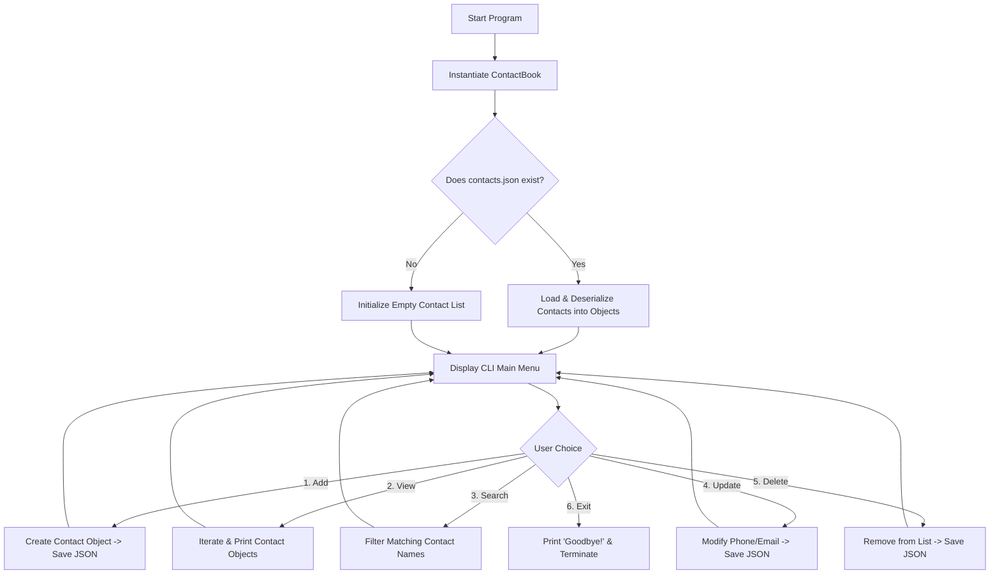

<div align="center">

# 📇 Project 7: Object-Oriented Contact Book

[](https://www.python.org/)
[](https://www.json.org/)
[](https://en.wikipedia.org/wiki/Object-oriented_programming)
[](https://code.visualstudio.com/)
[](LICENSE)

<p align="center">
  A full-featured, persistent Command-Line Interface (CLI) Contact Management System built in Python using Object-Oriented Programming (OOP) principles and permanent JSON data storage.
</p>

---

</div>

## 📑 Table of Contents

- [📌 Project Overview](#-project-overview)
- [✨ Key Features](#-key-features)
- [💡 Understanding JSON in Python](#-understanding-json-in-python)
- [🏗️ Object-Oriented Architecture](#️-object-oriented-architecture)
- [🔄 System Workflow](#-system-workflow)
- [📂 File Structure](#-file-structure)
- [💻 Complete Source Code](#-complete-source-code)
- [🖥️ Interactive CLI Walkthrough & Sample Output](#️-interactive-cli-walkthrough--sample-output)
- [🚀 How to Run](#-how-to-run)
- [📄 License](#-license)

---

## 📌 Project Overview

The **Object-Oriented Contact Book** is a real-world Python application designed to manage personal and professional contacts. It provides complete **CRUD** (Create, Read, Update, Delete) and Search capabilities.

Unlike simple in-memory scripts that lose data on exit, this project connects Python classes to permanent file storage using the built-in `json` module. Whenever contacts are added, modified, or deleted, changes are serialized directly to `contacts.json`.

---

## ✨ Key Features

- 👤 **Object-Oriented Design**: Dedicated `Contact` entity class and `ContactBook` manager class.
- 💾 **Persistent JSON Storage**: Automatic saving and loading so your contacts survive program restarts.
- 🔍 **Case-Insensitive Search**: Quick lookup by contact name regardless of uppercase or lowercase typing.
- ✏️ **In-Place Updates**: Easily modify a contact's phone number and email address.
- 🗑️ **Safe Deletion**: Removes contact objects from memory and syncs immediately to disk.
- 📑 **Clean Formatted Display**: Utilizes Python's `__str__` magic dunder method and `enumerate(start=1)` for clean numbered listings.

---

## 💡 Understanding JSON in Python

### What is a JSON file?
**JSON (JavaScript Object Notation)** is a lightweight, human-readable text format for storing and exchanging structured data. 

In Python:
- The `json.dump()` function converts Python dictionaries/lists into formatted JSON text inside a file (**Serialization**).
- The `json.load()` function reads JSON text from a file and parses it back into native Python lists/dictionaries (**Deserialization**).

#### Sample `contacts.json` File:
```json
[
    {
        "name": "John Doe",
        "phone": "123-456-7890",
        "email": "john.doe@example.com"
    },
    {
        "name": "Jane Smith",
        "phone": "098-765-4321",
        "email": "jane.smith@example.com"
    }
]
```

---

## 🏗️ Object-Oriented Architecture

```text
┌────────────────────────────────────────────────────────┐
│                      class Contact                     │
├────────────────────────────────────────────────────────┤
│ Attributes:                                            │
│  - name: str                                           │
│  - phone: str                                          │
│  - email: str                                          │
├────────────────────────────────────────────────────────┤
│ Methods:                                               │
│  + to_dict() -> dict                                   │
│  + __str__() -> str                                    │
└───────────────────────────┬────────────────────────────┘
                            │ 1 to Many Relationship
                            ▼
┌────────────────────────────────────────────────────────┐
│                    class ContactBook                   │
├────────────────────────────────────────────────────────┤
│ Attributes:                                            │
│  - contacts: list[Contact]                             │
├────────────────────────────────────────────────────────┤
│ Methods:                                               │
│  + add_contact(name, phone, email) -> None             │
│  + view_contacts() -> None                             │
│  + search_contact(name) -> None                        │
│  + update_contact(name, new_phone, new_email) -> None  │
│  + delete_contact(name) -> None                        │
│  + save_contacts() -> None   (Sync to contacts.json)   │
│  + load_contacts() -> None   (Read from contacts.json) │
└───────────────────────────┬────────────────────────────┘
                            │ Reads & Writes
                            ▼
                    📄 contacts.json
```

---

## 🔄 System Workflow



---

## 📂 File Structure

```text
contact-book/
├── 📄 contact_book.py       # Complete Python application
├── 📄 contacts.json         # Permanent JSON storage database
└── 📄 README.md             # Documentation
```

---

## 💻 Complete Source Code

```python
"""
PROJECT 7 - Object Oriented Contact Book
Concepts used: Classes, Objects, Encapsulation, __init__, methods, file handling (JSON).
"""

import json
import os

FILE_NAME = "contacts.json"  # Permanent JSON storage file


class Contact:
    """Represents a single contact person."""

    def __init__(self, name: str, phone: str, email: str):
        self.name = name
        self.phone = phone
        self.email = email

    def to_dict(self) -> dict:
        """Converts the Contact instance into a serializable dictionary."""
        return {"name": self.name, "phone": self.phone, "email": self.email}

    def __str__(self) -> str:
        """User-friendly string representation when printing a Contact."""
        return f"Name: {self.name} | Phone: {self.phone} | Email: {self.email}"


class ContactBook:
    """Manages a collection of Contact objects with persistent JSON storage."""

    def __init__(self):
        self.contacts = []
        self.load_contacts()

    def add_contact(self, name: str, phone: str, email: str) -> None:
        """Adds a new contact and commits to disk."""
        new_contact = Contact(name, phone, email)
        self.contacts.append(new_contact)
        self.save_contacts()
        print("✅ Contact added successfully.\n")

    def view_contacts(self) -> None:
        """Displays all stored contacts formatted with numbers."""
        if not self.contacts:
            print("⚠️ No contacts found.\n")
            return

        print("\n--- 📋 CONTACT LIST ---")
        for i, contact in enumerate(self.contacts, start=1):
            print(f"{i}. {contact}")
        print()

    def search_contact(self, name: str) -> None:
        """Searches for contacts by name (case-insensitive)."""
        found = [c for c in self.contacts if c.name.lower() == name.lower()]

        if found:
            print("\n--- 🔍 SEARCH RESULT ---")
            for c in found:
                print(c)
            print()
        else:
            print("❌ Contact not found.\n")

    def update_contact(self, name: str, new_phone: str, new_email: str) -> None:
        """Updates phone and email of a contact by name."""
        for c in self.contacts:
            if c.name.lower() == name.lower():
                c.phone = new_phone
                c.email = new_email
                self.save_contacts()
                print("✅ Contact updated successfully.\n")
                return
        print("❌ Contact not found.\n")

    def delete_contact(self, name: str) -> None:
        """Deletes a contact by name and saves the updated list."""
        for c in self.contacts:
            if c.name.lower() == name.lower():
                self.contacts.remove(c)
                self.save_contacts()
                print("🗑️ Contact deleted successfully.\n")
                return
        print("❌ Contact not found.\n")

    def save_contacts(self) -> None:
        """Serializes Contact objects to contacts.json."""
        data = [c.to_dict() for c in self.contacts]
        with open(FILE_NAME, "w", encoding="utf-8") as f:
            json.dump(data, f, indent=4)

    def load_contacts(self) -> None:
        """Loads contacts from contacts.json if the file exists."""
        if os.path.exists(FILE_NAME):
            try:
                with open(FILE_NAME, "r", encoding="utf-8") as f:
                    data = json.load(f)
                    self.contacts = [Contact(d["name"], d["phone"], d["email"]) for d in data]
            except json.JSONDecodeError:
                self.contacts = []


def main():
    """Main interactive loop for the Contact Book CLI."""
    book = ContactBook()

    while True:
        print("===== 📇 CONTACT BOOK MENU =====")
        print("1. Add Contact")
        print("2. View Contacts")
        print("3. Search Contact")
        print("4. Update Contact")
        print("5. Delete Contact")
        print("6. Exit")

        choice = input("\nEnter your choice (1-6): ").strip()

        if choice == "1":
            name = input("Enter name: ").strip()
            phone = input("Enter phone: ").strip()
            email = input("Enter email: ").strip()
            book.add_contact(name, phone, email)

        elif choice == "2":
            book.view_contacts()

        elif choice == "3":
            name = input("Enter name to search: ").strip()
            book.search_contact(name)

        elif choice == "4":
            name = input("Enter name to update: ").strip()
            phone = input("Enter new phone: ").strip()
            email = input("Enter new email: ").strip()
            book.update_contact(name, phone, email)

        elif choice == "5":
            name = input("Enter name to delete: ").strip()
            book.delete_contact(name)

        elif choice == "6":
            print("\n👋 Goodbye! Your contacts remain saved.")
            break

        else:
            print("⚠️ Invalid choice. Please select 1-6.\n")


if __name__ == "__main__":
    main()
```

---

## 🖥️ Interactive CLI Walkthrough & Sample Output

```text
===== 📇 CONTACT BOOK MENU =====
1. Add Contact
2. View Contacts
3. Search Contact
4. Update Contact
5. Delete Contact
6. Exit

Enter your choice (1-6): 1
Enter name: Tanmay
Enter phone: 9876543210
Enter email: tanmay@example.com
✅ Contact added successfully.

===== 📇 CONTACT BOOK MENU =====
1. Add Contact
2. View Contacts
3. Search Contact
4. Update Contact
5. Delete Contact
6. Exit

Enter your choice (1-6): 2

--- 📋 CONTACT LIST ---
1. Name: Tanmay | Phone: 9876543210 | Email: tanmay@example.com

===== 📇 CONTACT BOOK MENU =====
1. Add Contact
2. View Contacts
3. Search Contact
4. Update Contact
5. Delete Contact
6. Exit

Enter your choice (1-6): 6

👋 Goodbye! Your contacts remain saved.
```

---

## 🚀 How to Run

1. Open your terminal in the directory where `contact_book.py` is saved.
2. Run the script:
   ```bash
   python contact_book.py
   ```
3. An auto-generated `contacts.json` file will appear in the same folder once your first contact is saved!

---

<div align="center">

Made with ❤️ for Python OOP & Data Persistence | ⭐ Star this project if you found it useful author - ADESH SRIVASTAVA(TANMAY)!

</div>
