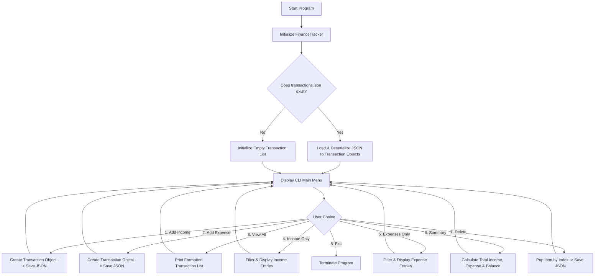

<div align="center">

# 💰 Project 7: Personal Finance Tracker

[](https://www.python.org/)
[](https://www.json.org/)
[](https://en.wikipedia.org/wiki/Object-oriented_programming)
[](https://code.visualstudio.com/)
[](LICENSE)

<p align="center">
  A clean, persistent Command-Line Interface (CLI) Personal Finance & Expense Management System built with Object-Oriented Python, automatic date logging, and JSON data persistence.
</p>

---

</div>

## 📑 Table of Contents

- [📌 Project Overview](#-project-overview)
- [✨ Key Features](#-key-features)
- [🏗️ OOP Architecture & Design](#️-oop-architecture--design)
- [🔄 System Workflow](#-system-workflow)
- [📂 File Structure](#-file-structure)
- [💡 JSON Storage Format](#-json-storage-format)
- [💻 Complete Source Code](#-complete-source-code)
- [🖥️ Interactive CLI Walkthrough & Sample Output](#️-interactive-cli-walkthrough--sample-output)
- [🚀 Quick Start & How to Run](#-quick-start--how-to-run)
- [📄 License](#-license)

---

## 📌 Project Overview

The **Personal Finance Tracker** helps users manage and monitor their cash flow. It records income sources, categorizes day-to-day expenditures, calculates real-time financial balance, and serializes transactions permanently into a local `transactions.json` file.

### Core Concepts Demonstrated:
- **Object-Oriented Programming (OOP)**: Separation of concerns between a data entity (`Transaction`) and the collection manager (`FinanceTracker`).
- **File Handling & JSON Serialization**: Preserving objects across application restarts using `json.dump()` and `json.load()`.
- **Automated Timestamping**: Using Python's `datetime.date` to record transaction dates automatically.
- **Generator Expressions**: Efficiently computing total income, total expenses, and net balance.

---

## ✨ Key Features

- 💵 **Income & Expense Tracking**: Categorize credit and debit entries with descriptions and decimal amounts.
- 📅 **Automated Timestamping**: Defaults to the current date (`YYYY-MM-DD`) unless explicitly overridden.
- 📊 **Real-time Balance Calculator**: Instant overview of Total Income, Total Expenses, and Net Savings/Balance.
- 🔍 **Type-Based Filtering**: Inspect all transactions or filter exclusively by `INCOME` or `EXPENSE`.
- 🗑️ **Index-Based Deletion**: Easily remove incorrect or outdated entries by their list index number.
- 💾 **Persistent JSON Storage**: All records are instantly synchronized to disk so data is never lost.

---

## 🏗️ OOP Architecture & Design

```text
┌─────────────────────────────────────────────────────────────────┐
│                        class Transaction                        │
├─────────────────────────────────────────────────────────────────┤
│ Attributes:                                                     │
│  - t_type: "income" | "expense"                                 │
│  - category: str (e.g. "Salary", "Food", "Rent")                │
│  - amount: float                                                │
│  - note: str                                                    │
│  - date: str (YYYY-MM-DD)                                       │
├─────────────────────────────────────────────────────────────────┤
│ Methods:                                                        │
│  + to_dict() -> dict                                            │
│  + __str__() -> str                                             │
└────────────────────────────────┬────────────────────────────────┘
                                 │ 1 to Many Relationship
                                 ▼
┌─────────────────────────────────────────────────────────────────┐
│                      class FinanceTracker                       │
├─────────────────────────────────────────────────────────────────┤
│ Attributes:                                                     │
│  - transactions: list[Transaction]                              │
├─────────────────────────────────────────────────────────────────┤
│ Methods:                                                        │
│  + add_transaction(t_type, category, amount, note) -> None      │
│  + view_transactions() -> None                                  │
│  + view_by_type(t_type) -> None                                 │
│  + get_balance() -> (total_income, total_expense, balance)      │
│  + show_summary() -> None                                       │
│  + delete_transaction(index) -> None                            │
│  + save_transactions() -> None  (Writes to transactions.json)   │
│  + load_transactions() -> None  (Reads from transactions.json)  │
└────────────────────────────────┬────────────────────────────────┘
                                 │ Syncs With
                                 ▼
                       📄 transactions.json
```

---

## 🔄 System Workflow



---

## 📂 File Structure

```text
personal-finance-tracker/
├── 📄 finance_tracker.py       # Main Python script with classes and CLI menu
├── 📄 transactions.json        # Permanent JSON storage database
└── 📄 README.md                # Project documentation
```

---

## 💡 JSON Storage Format

Each entry in `transactions.json` is stored with type, category, amount, custom note, and date:

```json
[
    {
        "t_type": "income",
        "category": "Salary",
        "amount": 50000.0,
        "note": "Monthly paycheck",
        "date": "2026-08-24"
    },
    {
        "t_type": "expense",
        "category": "Rent",
        "amount": 15000.0,
        "note": "Apartment rent",
        "date": "2026-08-24"
    },
    {
        "t_type": "expense",
        "category": "Groceries",
        "amount": 2500.0,
        "note": "Weekly shopping",
        "date": "2026-08-24"
    }
]
```

---

## 💻 Complete Source Code

```python
"""
PROJECT 7 - PERSONAL FINANCE TRACKER 
Concepts used: Classes, Objects, Encapsulation, __init__, methods, file handling (JSON), datetime.
"""

import json
import os
from datetime import date

FILE_NAME = "transactions.json"  # Permanent JSON storage database


class Transaction:
    """Represents a single monetary transaction (income or expense)."""

    def __init__(self, t_type: str, category: str, amount: float, note: str, t_date: str = None):
        self.t_type = t_type.lower()
        self.category = category
        self.amount = amount
        self.note = note
        self.date = t_date if t_date else str(date.today())

    def to_dict(self) -> dict:
        """Converts the Transaction instance into a JSON-serializable dictionary."""
        return {
            "t_type": self.t_type,
            "category": self.category,
            "amount": self.amount,
            "note": self.note,
            "date": self.date,
        }

    def __str__(self) -> str:
        """Formatted string representation for table-like console display."""
        sign = "+" if self.t_type == "income" else "-"
        return f"[{self.date}] {self.t_type.upper():7} | {self.category:12} | {sign}{self.amount:<10.2f} | {self.note}"


class FinanceTracker:
    """Manages the collection of transactions, balance calculations, and JSON sync."""

    def __init__(self):
        self.transactions = []
        self.load_transactions()

    def add_transaction(self, t_type: str, category: str, amount: float, note: str) -> None:
        """Adds a new transaction and commits to disk."""
        new_txn = Transaction(t_type, category, amount, note)
        self.transactions.append(new_txn)
        self.save_transactions()
        print(f"✅ {t_type.capitalize()} of {amount:.2f} added successfully.\n")

    def view_transactions(self) -> None:
        """Displays all recorded transactions."""
        if not self.transactions:
            print("⚠️ No transactions found.\n")
            return

        print("\n--- 📋 ALL TRANSACTIONS ---")
        for i, txn in enumerate(self.transactions, start=1):
            print(f"{i}. {txn}")
        print()

    def view_by_type(self, t_type: str) -> None:
        """Filters and displays transactions by type (income or expense)."""
        filtered = [t for t in self.transactions if t.t_type == t_type.lower()]

        if filtered:
            print(f"\n--- 📋 {t_type.upper()} TRANSACTIONS ---")
            for i, t in enumerate(filtered, start=1):
                print(f"{i}. {t}")
            print()
        else:
            print(f"⚠️ No {t_type} transactions found.\n")

    def get_balance(self) -> tuple:
        """Calculates total income, total expense, and current net balance."""
        total_income = sum(t.amount for t in self.transactions if t.t_type == "income")
        total_expense = sum(t.amount for t in self.transactions if t.t_type == "expense")
        balance = total_income - total_expense
        return total_income, total_expense, balance

    def show_summary(self) -> None:
        """Prints a financial health summary."""
        income, expense, balance = self.get_balance()
        print("\n--- 📊 FINANCIAL SUMMARY ---")
        print(f"Total Income  : +{income:.2f}")
        print(f"Total Expense : -{expense:.2f}")
        print(f"Net Balance   :  {balance:.2f}\n")

    def delete_transaction(self, index: int) -> None:
        """Deletes a transaction by its numbered index in the list."""
        if 0 <= index - 1 < len(self.transactions):
            removed = self.transactions.pop(index - 1)
            self.save_transactions()
            print(f"🗑️ Deleted: {removed}\n")
        else:
            print("❌ Invalid transaction number.\n")

    def save_transactions(self) -> None:
        """Saves current transaction objects into transactions.json."""
        data = [t.to_dict() for t in self.transactions]
        with open(FILE_NAME, "w", encoding="utf-8") as f:
            json.dump(data, f, indent=4)

    def load_transactions(self) -> None:
        """Loads transactions from transactions.json if available."""
        if os.path.exists(FILE_NAME):
            try:
                with open(FILE_NAME, "r", encoding="utf-8") as f:
                    data = json.load(f)
                    self.transactions = [
                        Transaction(d["t_type"], d["category"], d["amount"], d["note"], d.get("date"))
                        for d in data
                    ]
            except json.JSONDecodeError:
                self.transactions = []


def main():
    """Main CLI interaction loop."""
    tracker = FinanceTracker()

    while True:
        print("===== 💰 PERSONAL FINANCE TRACKER =====")
        print("1. Add Income")
        print("2. Add Expense")
        print("3. View All Transactions")
        print("4. View Income Only")
        print("5. View Expenses Only")
        print("6. Show Balance Summary")
        print("7. Delete a Transaction")
        print("8. Exit")

        choice = input("\nEnter your choice (1-8): ").strip()

        if choice == "1":
            category = input("Enter category (e.g. Salary, Bonus, Freelance): ").strip()
            amount = float(input("Enter amount: "))
            note = input("Enter note (optional): ").strip()
            tracker.add_transaction("income", category, amount, note)

        elif choice == "2":
            category = input("Enter category (e.g. Food, Rent, Utilities): ").strip()
            amount = float(input("Enter amount: "))
            note = input("Enter note (optional): ").strip()
            tracker.add_transaction("expense", category, amount, note)

        elif choice == "3":
            tracker.view_transactions()

        elif choice == "4":
            tracker.view_by_type("income")

        elif choice == "5":
            tracker.view_by_type("expense")

        elif choice == "6":
            tracker.show_summary()

        elif choice == "7":
            tracker.view_transactions()
            try:
                num = int(input("Enter transaction number to delete: "))
                tracker.delete_transaction(num)
            except ValueError:
                print("⚠️ Please enter a valid number.\n")

        elif choice == "8":
            print("\n👋 Goodbye! Keep tracking your finances wisely.")
            break

        else:
            print("⚠️ Invalid choice. Please select 1-8.\n")


if __name__ == "__main__":
    main()
```

---

## 🖥️ Interactive CLI Walkthrough & Sample Output

```text
===== 💰 PERSONAL FINANCE TRACKER =====
1. Add Income
2. Add Expense
3. View All Transactions
4. View Income Only
5. View Expenses Only
6. Show Balance Summary
7. Delete a Transaction
8. Exit

Enter your choice (1-8): 1
Enter category: Salary
Enter amount: 60000
Enter note: Monthly salary
✅ Income of 60000.00 added successfully.

===== 💰 PERSONAL FINANCE TRACKER =====
Enter your choice (1-8): 2
Enter category: Rent
Enter amount: 15000
Enter note: Apartment rent
✅ Expense of 15000.00 added successfully.

===== 💰 PERSONAL FINANCE TRACKER =====
Enter your choice (1-8): 6

--- 📊 FINANCIAL SUMMARY ---
Total Income  : +60000.00
Total Expense : -15000.00
Net Balance   :  45000.00

===== 💰 PERSONAL FINANCE TRACKER =====
Enter your choice (1-8): 8

👋 Goodbye! Keep tracking your finances wisely.
```

---

## 🚀 Quick Start & How to Run

1. Open your terminal in the directory where `finance_tracker.py` is saved.
2. Run the script:
   ```bash
   python finance_tracker.py
   ```
3. An auto-generated `transactions.json` database file will be created in the same folder to store your financial records permanently.

---

<div align="center">

Made with ❤️ for Python OOP & Personal Finance Automation | ⭐ Star this project if you found it useful AUTHOR - ADESH SRIVASTAVA!

</div>
