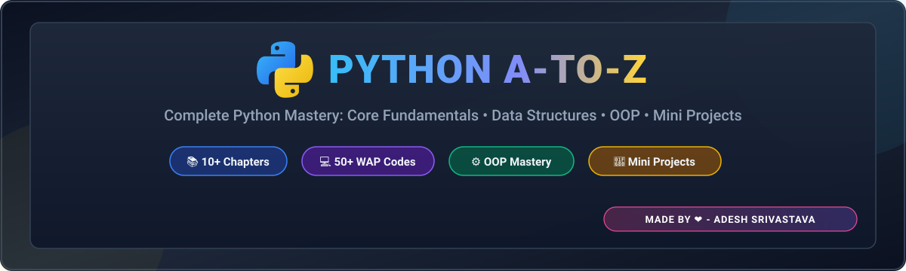

<div align="center">

# PYTHON A-TO-Z : Complete Mastery Repository

<!-- Native Vector Banner -->
<p align="center">
  
</p>

<!-- Tech Badges Banner -->
<p align="center">
  <a href="https://www.python.org/"></a>
  <a href="https://code.visualstudio.com/"></a>
  <a href="https://github.com/"></a>
  <a href="LICENSE"></a>
</p>

<p align="center">
  <strong>A structured, modular, and hands-on Python learning curriculum.</strong><br/>
  <em>Featuring core fundamentals, advanced data structures, OOP principles, and real-world mini-projects.</em>
</p>

---

</div>

## 📑 Table of Contents

| Section | Description | Quick Link |
| :--- | :--- | :---: |
| 🌟 **Highlights** | Core benefits, coding standards, and practice focus | [Jump to Section](#-repository-highlights) |
| 📂 **Curriculum Tree** | Complete folder organization and module index | [Jump to Section](#-curriculum--folder-structure) |
| 🗺️ **Module Breakdown** | Detailed chapter-by-chapter topics & WAP exercises | [Jump to Section](#️-detailed-module-breakdown) |
| 🛠️ **Tech Stack** | Languages, editor tools, and version control | [Jump to Section](#️-tech-stack--tools) |
| 🚀 **Quick Start** | How to clone, set up, and run projects locally | [Jump to Section](#-quick-start-guide) |

---

## 🌟 Repository Highlights

<div align="center">

| 🎯 Zero to Hero Roadmap | 🧩 50+ Hands-on WAPs | 🏗️ Real-World Mini Projects | ⚡ Clean PEP-8 Architecture |
| :---: | :---: | :---: | :---: |
| Step-by-step transition from beginner basics to advanced Object-Oriented concepts. | Practical logic building, interview questions, and algorithmic practice programs. | End-to-end applications demonstrating complete state and data flow. | Cleanly structured, modular files with full documentation and comments. |

</div>

---

## 📂 Curriculum & Folder Structure

### 📁 Directory Roadmap

| Directory | Module Name | Primary Focus | Status |
| :--- | :--- | :--- | :---: |
| `📁 CH-1-Intro/` | **Introduction to Python** | Syntax, Variables, Data Types, Type Casting, I/O | ✅ Completed |
| `📁 CH-2-Strings/` | **Strings & Manipulation** | Slicing `[::]`, Indexing, Built-in Methods | ✅ Completed |
| `📁 CH-3-Tuples-Lists/` | **Lists & Tuples** | Mutability vs Immutability, List Methods, Slicing | ✅ Completed |
| `📁 CH-4-Dicts-Sets/` | **Dictionaries & Sets** | Key-Value Pairs, Hashing, Mathematical Set Theory | ✅ Completed |
| `📁 CH-5-Loops/` | **Control Flow & Loops** | `while`, `for`, `range()`, `break`, `continue` | ✅ Completed |
| `📁 CH-6-Functions/` | **Functions & Modules** | Parameters, Default Values, `*args`, `**kwargs`, Return | ✅ Completed |
| `📁 CH-7-Recursion/` | **Recursion & Call Stack** | Base Cases, Recursive Stack Tracing, Algorithms | ✅ Completed |
| `📁 CH-8-File-IO/` | **File Handling (I/O)** | File Modes (`r`, `w`, `a`), `with` Context Managers | ✅ Completed |
| `📁 CH-9-OOPS-1/` | **Object-Oriented Basics** | Classes, Objects, `__init__` Constructor, Attributes | ✅ Completed |
| `📁 CH-9-OOPS-2/` | **Advanced OOP Concepts** | Inheritance, Polymorphism, Encapsulation, Dunder Methods | ✅ Completed |
| `📁 python-Mini-Project-1/` | **Mini Project 1** | Interactive Logic Application & CLI Flow | 🚀 Active |
| `📁 Python-Mini-project-2/` | **Mini Project 2** | Full State Management & Data Processing App | 🚀 Active |

---

## 🗺️ Detailed Module Breakdown

| Module | Core Concepts Covered | Hands-on Practice Problems (WAP) |
| :--- | :--- | :--- |
| **`CH-1-Intro`** | Variable assignment, Data Types (`int`, `float`, `str`, `bool`), Arithmetic, Modulo | Fee Calculator, Traffic Light System, Type Checker |
| **`CH-2-Strings`** | String slicing `[start:end:step]`, Indexing, `upper()`, `replace()`, `count()` | Palindrome String Checker, Substring Occurrence Count |
| **`CH-3-Tuples-Lists`** | Mutable lists, Immutable tuples, Single-element comma rule, List methods | List Palindrome Test, Grade Sorter, Movie List Collector |
| **`CH-4-Dicts-Sets`** | Associative maps, Nested dicts, Set operations (`union`, `intersection`, `diff`) | Unique Classroom Calculator, Marks Entry Dictionary |
| **`CH-5-Loops`** | Iteration with `for` & `while`, Loop control (`pass`, `break`, `continue`) | Multiplication Table Generator, Pattern Printing |
| **`CH-6-Functions`** | Code modularity, Reusable functions, Scope, Lambda expressions | Currency Converter, Factorial Function, Sum Calculator |
| **`CH-7-Recursion`** | Recursive call hierarchy, Base conditions, Recursive math | Nth Fibonacci Number, Recursive Array Traversal |
| **`CH-8-File-IO`** | Reading/Writing files, File pointer navigation, Safe resource closing | Log File Analyzer, Word Replacer in Text Files |
| **`CH-9-OOPS-1`** | Class definitions, Instantiation, `self` reference, Instance vs Class attributes | Bank Account Manager, Student Record System |
| **`CH-9-OOPS-2`** | Single & Multi-level Inheritance, Method Overriding, `@property`, `__str__` | Employee Hierarchy, Vector Addition with Dunder Methods |
| **`Mini Projects`** | Application lifecycle, Modular logic, Error handling & User interaction | Game Engines, Task Management Systems |

---

## 🛠️ Tech Stack & Tools

| Category | Tool | Description |
| :--- | :--- | :--- |
| **Language** |  | Core Programming Language (Python 3.x) |
| **Development IDE** |  | Visual Studio Code (Code Editing & Debugging) |
| **Version Control** |  &  | Source Code Management & Cloud Hosting |

---

## 🚀 Quick Start Guide

### 1. Clone the Repository
```bash
git clone https://github.com/your-username/PYTHON-A-TO-Z.git
cd PYTHON-A-TO-Z
```

### 2. Run Any Chapter or Project
```bash
# Run Chapter 1 Intro
python CH-1-Intro/main.py

# Run Mini-Project 1
python python-Mini-Project-1/main.py
```

---

<div align="center">

### ⭐ Star this Repository!
If you find this repository helpful for learning or teaching Python, please consider giving it a **star**!

<br/>

<sub>Crafted with passion for clean code & Python mastery 🚀</sub>

</div>

---

<div align="center">

Made with ❤️ for mastering Python | AUTHOR - ADESH SRIVASTAVA(TANMAY)!

</div>